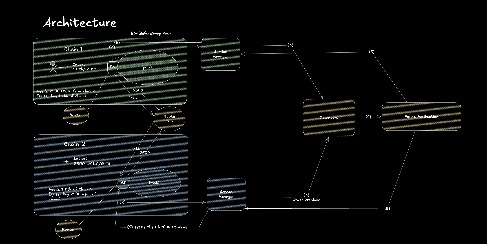
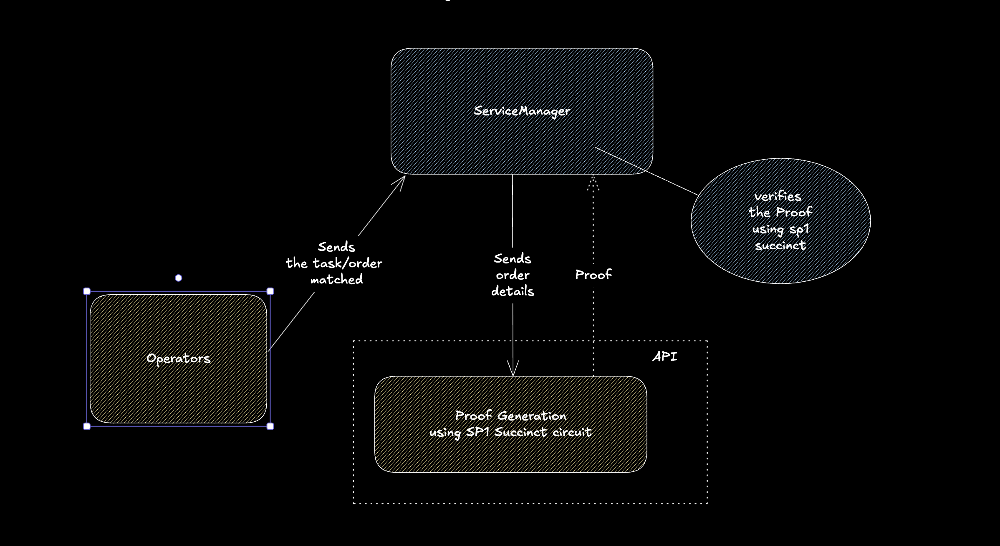
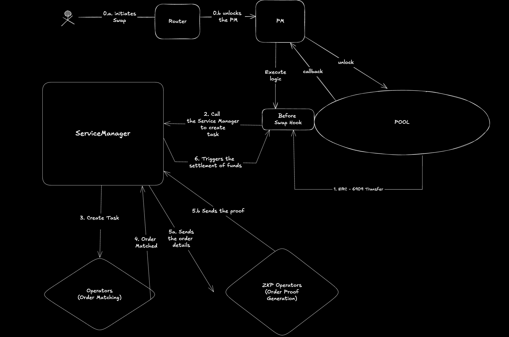

## Dark Cross CoW Hook 

### Architecture:


**Order Matching Network with end-to-end privacy using ZKP**

### Verifying Design Flow:



### Execution Flow:



0. Start anvil in a terminal:
***Run the rest of the commands in a new terminal***

1. AVS Deployment 
```
cd avs/contract
source .env
forge script script/DeployEigenLayerCore.sol --rpc-url $RPC_URL --private-key $PRIVATE_KEY --broadcast --sig "run()" 
forge script script/AVSDeployer.s.sol --rpc-url $RPC_URL --private-key $PRIVATE_KEY --broadcast --sig "run()"
SERVICE_MANAGER=$(cat deployments/avs/31337.json | jq -r '.addresses.orderServiceManager')
```
2. Hook Deployment
```
cd ../../hook 
forge script script/HookDeployer.s.sol --private-key $PRIVATE_KEY -vvvvv --broadcast --sig "run(address serviceManager)" -- $SERVICE_MANAGER
HOOK_ADDRESS=$(cat script/output/31337/darkCoWHook.json | jq -r '.addresses.hook')
```
3. Set Hook Address in AVS Service Manager
```
cast send --private-key $PRIVATE_KEY --gas-limit 1000000 $SERVICE_MANAGER "setHook(address)" $HOOK_ADDRESS
```
4. Register and start the Operator
```
cd ../operator
npx ts-node index.ts
```
5. Create task for the Operator:
   ***Run these set of commands in a new terminal 3***
```
cd operator
npx ts-node createNewTasks.ts
```
6. ZK proving network:
***New terminal commands***
```
cd order-engine/server
cargo run --release
```
7. Prover request runner
***New terminal commands***
```
cd operator
npx ts-node prove-request-handler.ts
```
