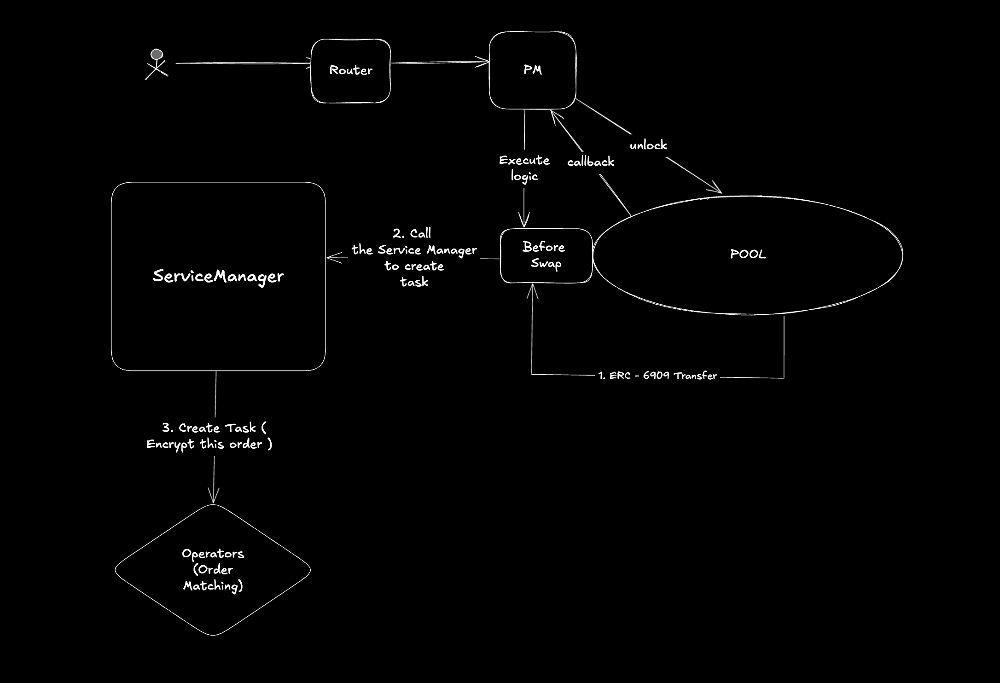

## CoW Basic Swap

Core Hook Functions to use 
1. beforeSwap: 
2. beforeSwapReturnDelta: 
3. AfterInitialize: 

The hook triggers the AVS to emit the task for the order to be resolved to the operators, 
Operators are the ones that resolve the order matching.
## System Flow
